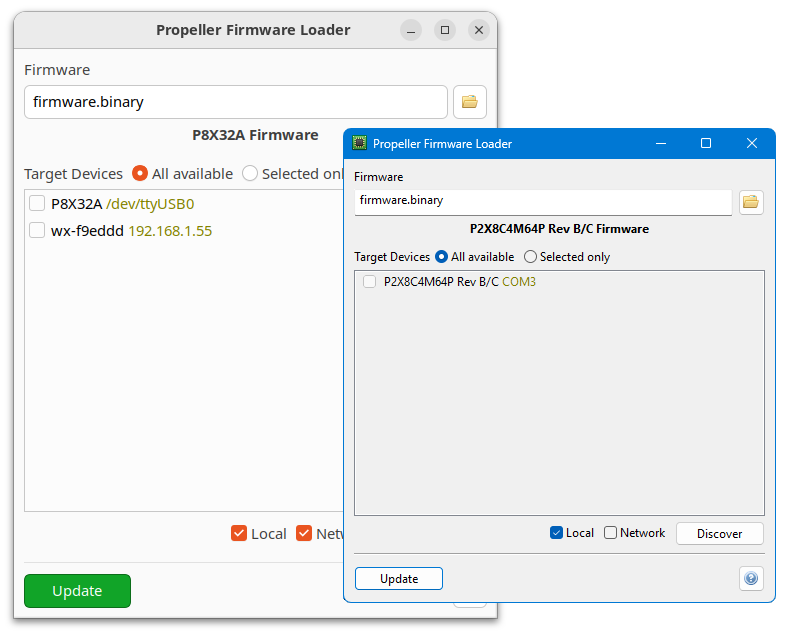

## Propeller Firmware Loader

Stand-alone loader for Propeller 1 and 2 firmware distribution.

  

**Features:**

 * Load P1 and P2 binary firmware files (with auto-detection)
 * Program multiple P1 or P2 devices
 * Program remote P1 or P2 devices equipped with the Parallax WX WiFi module
 * Multiplatform, available for Linux, Windows, MacOS and RaspberryPi
